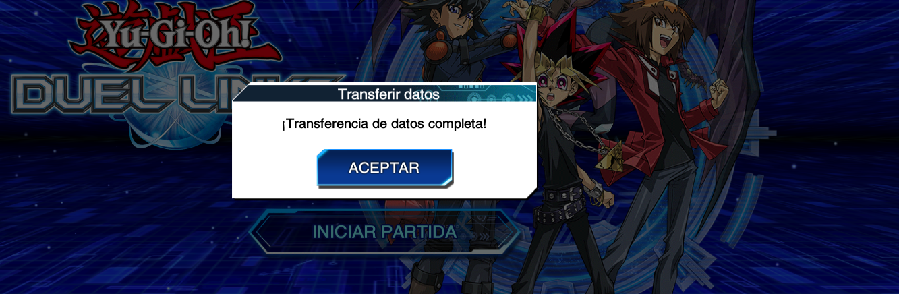

# Yu-Gi-Oh! Duel Links — KONAMI ID Data Transfer Fix on Linux

Fix para la transferencia de datos mediante **KONAMI ID** en **Yu-Gi-Oh! Duel Links** ejecutándose en Linux mediante **Steam Snap + Proton**.

El problema ocurre cuando el login de KONAMI termina correctamente en el navegador, pero el callback `duellinks://` no consigue comunicarse con la instancia de Duel Links que está ejecutándose dentro de Proton.

## Entorno probado

Esta solución fue probada con:

```text
OS: Xubuntu Linux
Steam: Snap
Game: Yu-Gi-Oh! Duel Links
Steam AppID: 601510
Proton: Proton 9.0 (Beta)
Browser: Google Chrome
```

> [!IMPORTANT]
> Las rutas de este documento corresponden a Steam instalado mediante **Snap**.
> Si utilizas Steam instalado mediante `.deb`, Flatpak u otro método, tendrás que adaptar las rutas.

---

# El problema

Duel Links utiliza un protocolo personalizado para regresar desde el navegador al juego:

```text
duellinks://
```

El flujo esperado es:

```text
Duel Links
    ↓
Browser
    ↓
KONAMI ID Login
    ↓
duellinks://<callback>
    ↓
DuelLinksTakeOver.exe
    ↓
Duel Links
```

En Windows, Duel Links registra un protocol handler similar a:

```text
HKEY_CLASSES_ROOT\duellinks
HKEY_CLASSES_ROOT\duellinks\Shell\Open\Command
```

que termina ejecutando:

```text
DuelLinksTakeOver.exe "%1"
```

En Linux + Proton este mecanismo no funciona directamente.

El navegador puede recibir correctamente el callback:

```text
duellinks://...
```

pero Linux necesita saber qué aplicación debe manejar ese protocolo.

Sin embargo, registrar únicamente un `x-scheme-handler` en Linux **no es suficiente**.

---

# Causa raíz

Duel Links utiliza un objeto de memoria compartida llamado:

```text
DlpcTakeoverPipe0573
```

El análisis de:

```text
takeover/DuelLinksTakeOver.exe
```

muestra que el helper utiliza:

```text
System.IO.MemoryMappedFiles.MemoryMappedFile.OpenExisting()
```

para intentar abrir:

```text
DlpcTakeoverPipe0573
```

El juego crea ese mapping con un tamaño de:

```text
0x400 = 1024 bytes
```

El helper posteriormente utiliza esa memoria para pasar el callback al juego.

El verdadero problema aparece por el aislamiento introducido por:

```text
Steam
   ↓
Steam Linux Runtime
   ↓
pressure-vessel
   ↓
Proton
   ↓
Wine
```

## El wineserver está aislado

Duel Links se ejecuta utilizando un `wineserver`.

Por ejemplo:

```text
481803 .../Proton 9.0 (Beta)/files/bin/wineserver -d
```

Dentro del entorno donde Steam ejecuta el juego existe el socket:

```text
/tmp/.wine-1000/server-XXXXXXXX/socket
```

Pero desde el host ese socket puede no ser visible.

Por ejemplo:

```bash
ls /tmp/.wine-$(id -u)/server-*/
```

puede mostrar únicamente:

```text
lock
```

Mientras que entrando al **mount namespace** del wineserver:

```bash
sudo nsenter -t <WINESERVER_PID> -m -- \
ls -la /tmp/.wine-$(id -u)/server-*/
```

aparecen:

```text
lock
socket
```

Este detalle resulta crítico.

---

# ¿Por qué falla DuelLinksTakeOver.exe?

Si ejecutamos desde el host:

```bash
wine64 DuelLinksTakeOver.exe 'duellinks://TEST'
```

Wine puede utilizar el mismo:

```text
WINEPREFIX
```

pero eso no garantiza que se conecte al mismo `wineserver`.

El resultado termina siendo conceptualmente:

```text
Duel Links
│
└── wineserver A
    │
    └── DlpcTakeoverPipe0573


DuelLinksTakeOver.exe
│
└── wineserver B
    │
    └── DlpcTakeoverPipe0573 DOES NOT EXIST
```

Durante el diagnóstico, Wine mostró:

```text
open_mapping(
    access=00000006,
    attributes=00000000,
    name=L"DlpcTakeoverPipe0573"
)

open_mapping() = OBJECT_NAME_NOT_FOUND
```

Sin embargo, el log del propio juego mostraba que Duel Links **sí había creado el mapping**:

```text
create_mapping(
    access=000f0007,
    flags=08000000,
    size=00000400,
    name=L"DlpcTakeoverPipe0573"
)

create_mapping() = 0
```

Por lo tanto:

- Duel Links sí crea el mapping.
- `DuelLinksTakeOver.exe` sí busca el mapping correcto.
- Ambos utilizan el mismo Wine prefix.
- Pero estaban conectándose a sesiones distintas de `wineserver`.

---

# Solución

La solución consiste en ejecutar:

```text
DuelLinksTakeOver.exe
```

dentro del **mount namespace del wineserver que ya está ejecutando Duel Links**.

El flujo final queda:

```text
KONAMI
   │
   │ authentication callback
   ▼
Chrome
   │
   │ duellinks://...
   ▼
Linux x-scheme-handler
   │
   ▼
duellinks-handler
   │
   ▼
sudo wrapper
   │
   ▼
nsenter
   │
   │ Steam mount namespace
   ▼
wine64
   │
   ▼
DuelLinksTakeOver.exe
   │
   ▼
Duel Links wineserver
   │
   ▼
DlpcTakeoverPipe0573
   │
   ▼
Duel Links
```

---

# 1. Registrar `duellinks://` en Linux

Primero crea el directorio si no existe:

```bash
mkdir -p ~/.local/share/applications
mkdir -p ~/.local/bin
```

Crea:

```bash
nano ~/.local/share/applications/duellinks-handler.desktop
```

Contenido:

```ini
[Desktop Entry]
Name=Yu-Gi-Oh! Duel Links
Comment=Yu-Gi-Oh Duel Links URL Handler
Exec=/home/YOUR_USER/.local/bin/duellinks-handler %u
Terminal=false
Type=Application
MimeType=x-scheme-handler/duellinks;
NoDisplay=true
```

Reemplaza:

```text
YOUR_USER
```

por tu usuario de Linux.

Después:

```bash
chmod +x ~/.local/share/applications/duellinks-handler.desktop
```

Registra el handler:

```bash
xdg-mime default \
duellinks-handler.desktop \
x-scheme-handler/duellinks
```

Actualiza la base de datos:

```bash
update-desktop-database ~/.local/share/applications
```

Comprueba:

```bash
gio mime x-scheme-handler/duellinks
```

Deberías obtener algo similar a:

```text
Default application for “x-scheme-handler/duellinks”:
duellinks-handler.desktop
```

---

# 2. Crear el wrapper para Duel Links

Crea:

```bash
sudo nano /usr/local/bin/duellinks-takeover
```

Contenido:

```bash
#!/bin/bash
set -e

URI="$1"

# Only accept Duel Links callbacks.
case "$URI" in
    duellinks://*) ;;
    *) exit 1 ;;
esac

USER_NAME="YOUR_USER"
USER_ID="$(id -u "$USER_NAME")"
GROUP_ID="$(id -g "$USER_NAME")"

STEAM_ROOT="/home/$USER_NAME/snap/steam/common/.local/share/Steam"

PREFIX="$STEAM_ROOT/steamapps/compatdata/601510/pfx"

WINE="$STEAM_ROOT/steamapps/common/Proton 9.0 (Beta)/files/bin/wine64"

TAKEOVER="$STEAM_ROOT/steamapps/common/Yu-Gi-Oh! Duel Links/takeover/DuelLinksTakeOver.exe"

# Locate the Proton 9 wineserver.
PID="$(
    pgrep -u "$USER_NAME" \
    -f '/Proton 9\.0 \(Beta\)/files/bin/wineserver' |
    head -n1
)"

if [ -z "$PID" ]; then
    exit 2
fi

exec /usr/bin/nsenter \
    -t "$PID" \
    -m \
    --setuid="$USER_ID" \
    --setgid="$GROUP_ID" \
    -- \
    /usr/bin/env \
    WINEPREFIX="$PREFIX" \
    WINEFSYNC=1 \
    WINEESYNC=1 \
    "$WINE" \
    "$TAKEOVER" \
    "$URI"
```

Reemplaza:

```text
YOUR_USER
```

por tu usuario.

Después:

```bash
sudo chown root:root /usr/local/bin/duellinks-takeover
sudo chmod 755 /usr/local/bin/duellinks-takeover
```

---

# 3. Configurar sudo

`nsenter` necesita privilegios para entrar al mount namespace.

**NO** es recomendable configurar:

```text
NOPASSWD: /usr/bin/nsenter
```

porque permitir `nsenter` arbitrariamente mediante sudo sería demasiado permisivo.

En su lugar, autorizaremos únicamente nuestro wrapper.

Ejecuta:

```bash
sudo visudo -f /etc/sudoers.d/duellinks
```

Agrega:

```text
YOUR_USER ALL=(root) NOPASSWD: /usr/local/bin/duellinks-takeover
```

Reemplaza `YOUR_USER`.

Guarda el archivo.

Puedes comprobarlo con:

```bash
sudo -n /usr/local/bin/duellinks-takeover 'duellinks://TEST'
```

Con Duel Links abierto, el helper debería interactuar con la instancia existente del juego sin solicitar contraseña.

---

# 4. Crear el handler de Linux

Crea:

```bash
nano ~/.local/bin/duellinks-handler
```

Contenido:

```bash
#!/bin/bash

URI="$1"

case "$URI" in
    duellinks://*) ;;
    *) exit 1 ;;
esac

exec sudo -n /usr/local/bin/duellinks-takeover "$URI"
```

Hazlo ejecutable:

```bash
chmod +x ~/.local/bin/duellinks-handler
```

---

# 5. Probar el protocolo

Primero abre Duel Links desde Steam.

Después ejecuta:

```bash
xdg-open 'duellinks://TEST'
```

El sistema puede preguntarte si deseas abrir:

```text
Yu-Gi-Oh! Duel Links
```

Acepta.

Si Duel Links reacciona al callback, el bridge está funcionando.

---

# 6. Transferencia mediante KONAMI ID

Ahora puedes iniciar el procedimiento normal de transferencia de datos desde Duel Links.

El flujo debería ser:

```text
Duel Links
    ↓
Transfer Data
    ↓
KONAMI ID
    ↓
Browser
    ↓
Login
    ↓
duellinks:// callback
    ↓
Linux handler
    ↓
nsenter
    ↓
DuelLinksTakeOver.exe
    ↓
Duel Links
```

Al finalizar correctamente, Duel Links debería mostrar:

```text
¡Transferencia de datos completa!
```

---

# WINEFSYNC

Durante el diagnóstico apareció otro detalle importante.

Al conseguir entrar al namespace correcto inicialmente obtuvimos:

```text
Server is running with WINEFSYNC but this process is not,
please enable WINEFSYNC or restart wineserver.
```

Esto fue una señal importante porque demostraba que Wine **finalmente estaba encontrando el wineserver existente**.

La instancia de Duel Links estaba ejecutándose con:

```text
WINEFSYNC=1
WINEESYNC=1
```

Por eso agregamos esas mismas variables al proceso de `DuelLinksTakeOver.exe`:

```bash
/usr/bin/env \
WINEPREFIX="$PREFIX" \
WINEFSYNC=1 \
WINEESYNC=1 \
"$WINE" \
"$TAKEOVER" \
"$URI"
```

Después de hacerlo, el helper pudo interactuar correctamente con Duel Links.

---

# Reverse engineering de DuelLinksTakeOver.exe

Durante la investigación se utilizó:

```bash
sudo apt install mono-utils
```

y posteriormente:

```bash
monodis DuelLinksTakeOver.exe > takeover.il
```

El assembly contiene clases relacionadas con IPC:

```text
YgomSystem.Utility.NamedPipeBase
YgomSystem.Utility.NamedPipeClient
YgomSystem.Utility.NamedPipeOnMmf
YgomSystem.Utility.NamedPipeServer
```

También aparecen las constantes:

```text
DlpcTakeoverPipe0573
MutexDlpcTakeoverPipe0573
dlpctakeover://
```

El modo utilizado por el helper corresponde a:

```text
Mmf
```

es decir:

```text
Memory Mapped File
```

El helper intenta abrir:

```text
DlpcTakeoverPipe0573
```

mediante:

```text
MemoryMappedFile.OpenExisting()
```

y trabaja con un view accessor de:

```text
1024 bytes
```

---

# Confirmación desde el juego

Las mismas referencias pueden encontrarse dentro de:

```text
dlpc_Data/il2cpp_data/Metadata/global-metadata.dat
```

Por ejemplo:

```bash
strings \
dlpc_Data/il2cpp_data/Metadata/global-metadata.dat |
grep -E 'DlpcTakeover|dlpctakeover'
```

puede revelar referencias como:

```text
DlpcTakeoverPipe0573
MutexDlpcTakeoverPipe0573
dlpctakeover://
```

---

# Debugging con Wine

Para investigar el problema se puede activar temporalmente:

```bash
WINEDEBUG=+server
```

Cuando `DuelLinksTakeOver.exe` se ejecutaba fuera de la sesión correcta observamos:

```text
open_mapping(
    access=00000006,
    attributes=00000000,
    name=L"DlpcTakeoverPipe0573"
)

open_mapping() = OBJECT_NAME_NOT_FOUND
```

Mientras que el juego mostraba:

```text
create_mapping(
    access=000f0007,
    flags=08000000,
    size=00000400,
    name=L"DlpcTakeoverPipe0573"
)

create_mapping() = 0
```

Esto permitió concluir que el problema no era que Duel Links no estuviera creando el IPC.

El problema era que ambos procesos estaban en sesiones diferentes de Wine.

---

# Cómo comprobar el wineserver

Con Duel Links abierto:

```bash
pgrep -a wineserver
```

Deberías ver el wineserver utilizado por Proton.

También puedes obtener el PID del juego:

```bash
pgrep -n dlpc.exe
```

y comprobar variables relevantes:

```bash
PID="$(pgrep -n dlpc.exe)"

tr '\0' '\n' < "/proc/$PID/environ" |
grep -E 'WINE|STEAM_COMPAT|PROTON'
```

Entre ellas deberían aparecer valores similares a:

```text
STEAM_COMPAT_APP_ID=601510
STEAM_COMPAT_PROTON=1
WINEPREFIX=.../compatdata/601510/pfx/
WINEFSYNC=1
WINEESYNC=1
```

---

# Cómo comprobar el aislamiento del socket

Desde el host:

```bash
find /tmp/.wine-$(id -u) -maxdepth 2 -ls
```

En el caso investigado, el directorio del wineserver existía pero el socket no era visible.

Entrando al mount namespace:

```bash
WINESERVER_PID="$(pgrep -u "$USER" -f '/Proton 9\.0 \(Beta\)/files/bin/wineserver' | head -n1)"

sudo nsenter -t "$WINESERVER_PID" -m -- \
find /tmp/.wine-$(id -u) -maxdepth 2 -ls
```

el socket sí aparecía:

```text
/tmp/.wine-1000/server-XXXXXXXX/socket
```

Esta fue la pieza clave para identificar el problema.

---

# ¿Por qué `proton run` no solucionaba el problema?

También se intentó ejecutar el helper mediante Proton utilizando el mismo compatdata:

```bash
proton run DuelLinksTakeOver.exe 'duellinks://TEST'
```

e incluso:

```bash
proton runinprefix ...
```

Sin embargo, durante las pruebas aparecía un segundo `wineserver`.

Conceptualmente:

```text
Game
 └── wineserver #1

External Proton command
 └── wineserver #2
```

Por eso compartir:

```text
STEAM_COMPAT_DATA_PATH
```

o:

```text
WINEPREFIX
```

no era suficiente.

El proceso necesitaba poder acceder al **socket de la sesión Wine existente**, que estaba aislado dentro del mount namespace de Steam.

---

# ¿Por qué no utilizar winebrowser.exe?

También se probó utilizar:

```text
winebrowser.exe
```

como bridge entre Linux y Proton.

Esto produjo un loop:

```text
Linux handler
    ↓
winebrowser.exe
    ↓
duellinks://
    ↓
Linux handler
    ↓
winebrowser.exe
    ↓
...
```

Por lo tanto `winebrowser.exe` no resuelve este caso.

---

# Seguridad

## Nunca publiques un callback real

Durante la autenticación KONAMI genera una URL similar a:

```text
duellinks://...
```

No publiques el callback completo en:

- GitHub
- Issues
- Logs
- Screenshots
- Discord
- Reddit
- Stack Overflow

Utiliza siempre ejemplos ficticios:

```text
duellinks://TEST
```

## No otorgues acceso libre a nsenter

Evita:

```text
YOUR_USER ALL=(root) NOPASSWD: /usr/bin/nsenter
```

`nsenter` es una herramienta muy poderosa.

El enfoque utilizado aquí permite únicamente:

```text
/usr/local/bin/duellinks-takeover
```

mediante sudo.

---

# Limitaciones

La solución documentada fue probada específicamente con:

```text
Steam Snap
Proton 9.0 (Beta)
Yu-Gi-Oh! Duel Links AppID 601510
Xubuntu
```

Puede requerir modificaciones para:

```text
Steam .deb
Steam Flatpak
otras versiones de Proton
otras distribuciones Linux
```

También hay una limitación en el ejemplo del wrapper:

```bash
pgrep -u "$USER_NAME" \
-f '/Proton 9\.0 \(Beta\)/files/bin/wineserver' |
head -n1
```

Si existen varios juegos ejecutándose simultáneamente con la misma versión de Proton, podría seleccionar el `wineserver` incorrecto.

Una implementación futura debería localizar específicamente el wineserver asociado al compatdata/AppID:

```text
601510
```

---

# Resultado

Después de implementar el bridge:

```text
KONAMI Login
      ↓
duellinks://
      ↓
Linux
      ↓
Steam namespace
      ↓
DuelLinksTakeOver.exe
      ↓
Duel Links
```

la transferencia termina correctamente:

```text
¡Transferencia de datos completa!
```

## 🎉 Duel Links KONAMI ID Data Transfer working on Linux

---

# TL;DR

El problema no era Chrome.

El problema no era KONAMI ID.

El problema no era que Duel Links no creara su IPC.

El problema tampoco era simplemente el registro de `duellinks://`.

El problema era:

> `DuelLinksTakeOver.exe` ejecutado desde Linux no podía acceder al wineserver donde estaba ejecutándose Duel Links porque el socket de Wine estaba aislado dentro del mount namespace creado por Steam/pressure-vessel.

La solución:

```text
x-scheme-handler
        ↓
wrapper
        ↓
nsenter
        ↓
Steam mount namespace
        ↓
same wineserver
        ↓
DuelLinksTakeOver.exe
        ↓
DlpcTakeoverPipe0573
        ↓
Duel Links
```

---

## Result



**¡Transferencia de datos completa!** — KONAMI ID data transfer successfully working on Linux with Steam + Proton.

# Disclaimer

Este proyecto no está afiliado con KONAMI, Valve, WineHQ ni CodeWeavers.

Yu-Gi-Oh! y Yu-Gi-Oh! Duel Links son marcas de sus respectivos propietarios.

La información aquí presentada tiene fines técnicos y educativos.

## Disclaimer

This project is not affiliated with KONAMI, Valve, WineHQ, or CodeWeavers.

Yu-Gi-Oh! and Yu-Gi-Oh! Duel Links are trademarks of their respective owners.

The information provided here is intended for technical and educational purposes.

## License

This project is licensed under the MIT License.

Copyright © 2026 Fernando López Moreno - zencoud

See the [LICENSE](LICENSE) file for details.
